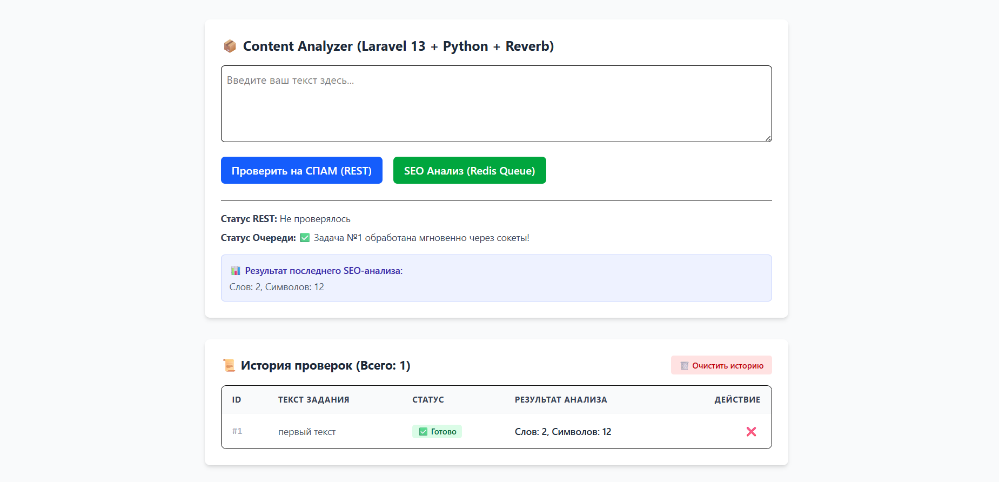

# 📦 Content Analyzer (Laravel 13 + Python Microservice + WebSockets)

Высоконагруженное асинхронное веб-приложение для глубокого SEO-анализа и проверки текста на спам. Архитектура построена на базе изолированных микросервисов в Docker, общающихся через очереди Redis и транслирующих результаты в браузер в реальном времени через веб-сокеты.

<!-- 🔥 СКРИНШОТ ПРОЕКТА (Убедитесь, что файл screenshot.png лежит в корне рядом с этим README) -->


## 🚀 Что сделано в проекте

1. **Изолированный Docker-контур**: Инфраструктура полностью закрыта внутри сети Docker. Единственной публичной точкой входа является сервер **Nginx**. Все базы данных, очереди и микросервисы скрыты от внешней сети Windows для максимальной безопасности.
2. **Асинхронные очереди (Redis + Python Worker)**: Тяжелые задачи SEO-анализа (подсчет слов, символов и имитация расчетов) отправляются бэкендом в Redis. Отдельный изолированный контейнер воркера на Python забирает задачи по протоколу `blpop`, обрабатывает их и сохраняет историю в **MySQL**.
3. **Кастомный TCP-мост (Прямые сокеты)**: Для обхода системных ограничений среды окружения, интеграция Laravel с Redis (как для отправки задач, так и для фоновой подписки Pub/Sub) переписана на чистые сетевые TCP-сокеты (`fsockopen`), что гарантирует 100% стабильность без установки расширений `phpredis`.
4. **Автоматический Сервер Сокетов (Laravel Reverb)**: Развернут и полностью автоматизирован внутри Docker полноценный WebSocket-сервер. Он вынесен в отдельный контейнер `laravel-reverb` и проброшен на порт `8090` для Windows-клиентов.
5. **Фоновый слушатель событий**: Создан демон `laravel-listener`, который непрерывно слушает Redis-канал сигналов от Python. При завершении задачи воркером, демон мгновенно транслирует событие в Reverb в режиме `ShouldBroadcastNow`.
6. **Реальное время на фронтенде (Livewire Volt)**: Реализована реактивная подписка на сокеты на стороне фронтенда. Статус задачи в истории проверок переключается с `⚙️ В работе` на `✅ Готово` автоматически без перезагрузки страницы и без лишних запросов к базе данных.
7. **Управление историей (CRUD & TRUNCATE)**: На экран выведена интерактивная таблица истории всех проверок из MySQL с функциями поштучного удаления записей и полной очистки базы данных с защитой от случайного нажатия (`wire:confirm`).

---

## 🛠️ Сетевая архитектура и порты

Проект использует строгое разделение внутренних хостов Docker и внешних портов Windows:
* **Сайт в браузере**: `http://localhost:8083` (внешний порт проксируется через Nginx на внутренний 80 порт Laravel).
* **База данных (phpMyAdmin)**: `http://localhost:8083/phpmyadmin/` (запросы проксируются через Nginx напрямую в Apache-сервер контейнера phpMyAdmin, пути JS/CSS защищены через `PMA_ABSOLUTE_URI`).
* **Веб-сокеты (Браузер)**: Стучатся из Windows на `ws://localhost:8090` (проброшен из контейнера `laravel-reverb:8080`).
* **Внутренняя связь (Бэкенд)**: Контейнер `laravel-listener` общается с сокетами по внутреннему имени сети `http://laravel-reverb:8080`.

---

## 📦 Спецификация микросервисов (Docker-compose)

* **ca-nginx**: Веб-сервер Alpine, единая точка входа.
* **ca-laravel**: Приложение на PHP 8.3 и Laravel 13.8 (интерфейс Livewire Volt + Tailwind CSS).
* **ca-laravel-reverb**: Выделенный сервер сокетов Reverb.
* **ca-laravel-listener**: Фоновый демон Artisan-команды `python:listen` для связи Redis -> Reverb.
* **ca-vite**: Node 20 сборщик фронтенда с настроенным HMR на loopback-интерфейс.
* **ca-redis**: Брокер очередей и Pub/Sub каналов.
* **ca-mysql**: Хранилище постоянных данных и истории проверок.
* **ca-phpmyadmin**: Панель управления СУБД.
* **ca-python-api**: FastAPI микросервис для синхронных проверок текста на спам (REST).
* **ca-python-worker**: Фоновый скрипт `worker.py` на чистом Python для SEO-анализа.

---

## 💻 Клонирование и быстрый запуск проекта

### 1. Клонирование репозитория
Стяните проект из вашего удаленного репозитория на локальную машину (замените на вашу актуальную ссылку):
```bash
git clone https://github.com/Laracoper/Content-Analyzer-Laravel-13-Python-Microservice-WebSockets-.git
cd content-analyzer
```

### 2. Переменные окружения
Убедитесь, что в корневой папке проекта (на одном уровне с `docker-compose.yml`) создан файл `.env` с указанием внешнего порта веб-сайта:
```text
APP_PORT=8083
```

### 3. Сборка и запуск всех контейнеров
Запустите всю экосистему микросервисов в фоновом режиме одной командой:
```bash
docker compose up -d --build
```

### 4. Разворачивание таблиц БД
Выполните миграции внутри контейнера для создания таблицы `seo_tasks` в MySQL:
```bash
docker compose exec laravel-app php artisan migrate
```

---

## 🔗 Ссылки для работы в браузере

* **Панель анализатора**: [http://localhost:8083](http://localhost:8083)
* **Управление базой данных**: [http://localhost:8083/phpmyadmin/](http://localhost:8083/phpmyadmin/)

*Реквизиты доступа к MySQL:* **Логин:** `root` | **Пароль:** `root_password` | **База данных:** `ca_database`
